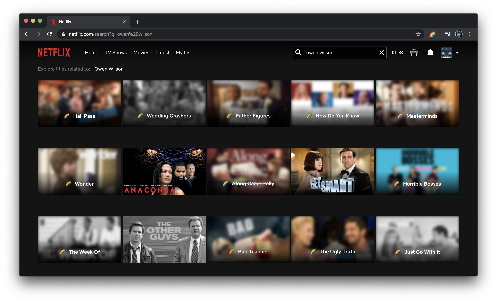

# Pleasant Times

## Motivation

As of writing, the COVID-19 situation requires most of us to stay at home.

This means watching a lot of Netflix shows. **A lot.**

Unfortunately, this in turn means browsing through a tsunami of Adam Sandler, Owen Wilson or Kevin Hart movie thumbnails while hoping to find something to watch. 

This is why this Chrome extension filters out some of the lowest-quality content from Netflix, as rated in a completly arbitrary way. Because no one should suffer through _Happy Gilmore_ ever again.

## Support

If you enjoyed this extension, please consider donating time and/or resources to your local community to help during these potentially challenging time. 

Remember that [mental well-being](https://www.camh.ca/en/health-info/mental-health-and-covid-19) is just as important as physical health.  
Stay safe, and support each other.

## Installing

The Chrome extension can be installed by:
 1. Downloading the `.zip` file from the [_Releases_](https://github.com/philsawicki/pleasant-times/releases) page and unzipping it locally.
 2. Navigating to `chrome://extensions`.
 3. Enabling the `Developer mode`.
 4. Drag-and-dropping the unzipped extension to the `chrome://extensions` page.
